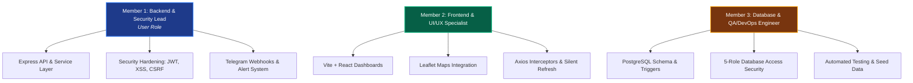
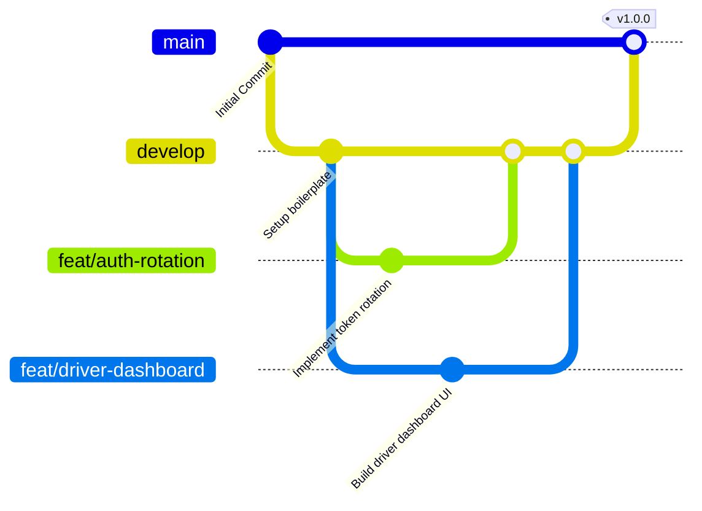

# TaxiTrio — Team Division, Git Workflow & Development Roadmap

This document outlines the division of responsibilities, collaboration workflows, and the next-phase roadmap for the 3-member development team working on the **TaxiTrio** booking platform.

---

## 1. Team Roles & Division of Responsibilities

Given the architecture of the project (React frontend, Node/Express backend, PostgreSQL database), here is a balanced division of roles for 3 members.



### 👤 Member 1 (You): Lead Backend & Security Engineer
* **Express.js Service Layer**: Maintenance and extension of backend routes, controllers, and services (e.g., [`booking_service.js`](file:///C:/Users/PCN/OneDrive%20-%20Cambodia%20Academy%20of%20Digital%20Technology/CADT_Y2/Y2T3-Subjects/TaxiTrio/TaxiTrio/Backend/src/services/booking_service.js), [`auth_service.js`](file:///C:/Users/PCN/OneDrive%20-%20Cambodia%20Academy%20of%20Digital%20Technology/CADT_Y2/Y2T3-Subjects/TaxiTrio/TaxiTrio/Backend/src/services/auth_service.js)).
* **Security Hardening**: Hardening the authentication endpoints, rotating short-lived JWT access tokens and long-lived HTTP-only refresh tokens, and ensuring vertical/horizontal privilege checks.
* **Integrations**: Implementing and refining the Telegram Bot admin notifications, callback queries, and handling file uploads using `multer`.

### 👤 Member 2: Frontend & UI/UX Developer
* **Vite + React Client**: Building and maintaining interactive user interfaces for the 3 distinct dashboard views (Traveler, Driver, Admin) using responsive Custom CSS/Tailwind.
* **Map & Live Widgets**: Integrating Leaflet map interfaces for coordinate-based routing and calculating ride distance dynamically on the frontend.
* **State & Token Management**: Managing global state (authentication, theme, language translations) and implementing Axios interceptors to automatically fetch rotated access tokens upon `401 Unauthorized` responses.

### 👤 Member 3: Database & QA/DevOps Engineer
* **Database Architecture & Optimizations**: Managing the DDL schema tables ([`createTables.sql`](file:///C:/Users/PCN/OneDrive%20-%20Cambodia%20Academy%20of%20Digital%20Technology/CADT_Y2/Y2T3-Subjects/TaxiTrio/TaxiTrio/database/ddl/createTables.sql)), indexing frequently queried routes, and maintaining test/seed data.
* **Database Automations**: Developing and debugging PostgreSQL triggers ([`trigger.sql`](file:///C:/Users/PCN/OneDrive%20-%20Cambodia%20Academy%20of%20Digital%20Technology/CADT_Y2/Y2T3-Subjects/TaxiTrio/TaxiTrio/database/trigger/trigger.sql)) for status auditing and user alerts.
* **Role-Based Security & DevOps**: Enforcing the 5-role privilege scheme (`role.sql`) at database-level connections, configuring environment settings, creating backup scripts, and managing CI/CD or local test setups.

---

## 2. Git Collaboration & Branching Strategy

To avoid merge conflicts and keep code reviews clean, we recommend adopting the **Git Flow** branching model on GitHub.



### Branch Naming Conventions
1. **`main`**: The production-ready branch. Only tested, working code from `develop` is merged here.
2. **`develop`**: The integration branch. All feature branches merge into `develop`.
3. **`feat/...`**: Feature branches for new features.
   * *Examples*: `feat/leaflet-maps`, `feat/telegram-webhook`, `feat/db-triggers`.
4. **`fix/...`**: Bugfix branches for resolving issues.
   * *Examples*: `fix/jwt-expiration`, `fix/navbar-responsive`.
5. **`docs/...`**: Documentation adjustments.

### Pull Request (PR) Workflow
- **No Direct Pushes to `main` or `develop`**: All team members work on their specific `feat/` or `fix/` branch.
- **Pull Request to `develop`**: When a feature is complete, open a PR to merge into `develop`.
- **Peer Review**: At least one other team member must review the PR, verify that it runs locally, and approve it before merging.
- **Testing**: Member 3 (QA) should run verification scripts or automated tests before merging to confirm no regression errors.

---

## 3. Recommended Development Roadmap

```gantt
    title TaxiTrio Development Timeline
    dateFormat  YYYY-MM-DD
    section Git & Alignment
    Repository Setup & Member Roles :active, 2026-06-17, 2d
    section Phase 1: Core Integration
    API Testing & Database Role Bindings : 2026-06-19, 4d
    Frontend Dashboards & Live Maps : 2026-06-20, 5d
    section Phase 2: Security & Alerts
    HTTP-only Refresh Interceptors : 2026-06-23, 4d
    Telegram Bot Alerts & Webhooks : 2026-06-25, 3d
    section Phase 3: QA & Handover
    End-to-End Bug Hunting & Edge Cases : 2026-06-27, 4d
    Deployment Prep & Readme Docs : 2026-06-29, 3d
```

### 📍 Next Immediate Action Items
1. **GitHub Setup**: Initialize the remote repository and invite the other two members as collaborators.
2. **Environment Synchronization**: Ensure all members set up PostgreSQL with the DDL/DML scripts and configure their local `.env` files.
3. **Task Assignment**: Let members assign themselves the initial tickets based on their roles.
